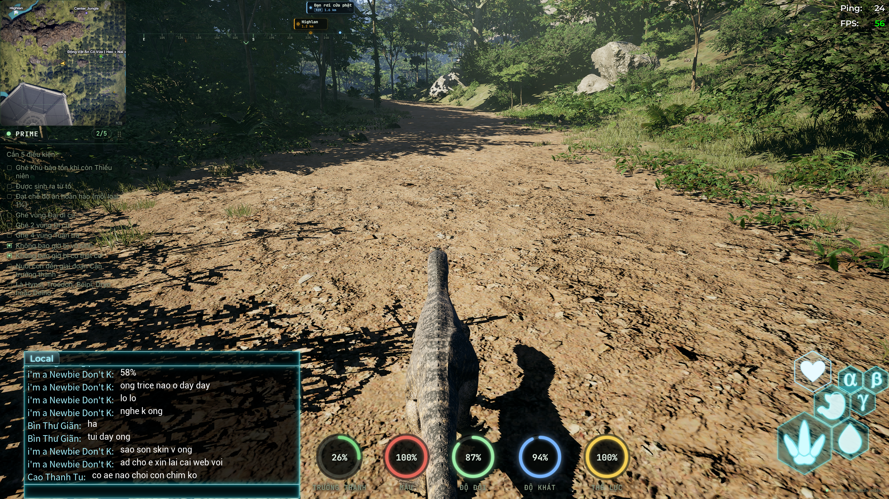
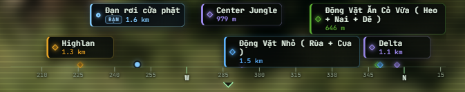

# TheIsleHud

**English** | **[Tiếng Việt](README.vi.md)**

Customizable Windows in-game HUD for **The Isle**, based on
[reversum/isle-overlay](https://github.com/reversum/isle-overlay).

Vietnamese-first HUD with a persistent in-game overlay, movable widgets,
minimap, live player data, and a smooth location/friend compass. The
dashboard/menu (tabs and Settings) runs in its own normal Windows window that
opens automatically when the app starts; after that, show or hide it from the
taskbar or the tray icon. The in-game overlay itself has no hotkey to open
it, and stays visible while you play.

> [!IMPORTANT]
> This project is a derivative work built on
> [TheIsleAE3Mien/TheIsleCustomHud](https://github.com/TheIsleAE3Mien/TheIsleCustomHud),
> itself derived from [reversum/isle-overlay](https://github.com/reversum/isle-overlay).
> Neither upstream repository published a license when its source was imported,
> so this project does not claim to relicense that source code, and this
> repository does not carry the full upstream Git history. See
> [License and attribution](#license-and-attribution) and
> [THIRD_PARTY_NOTICES.md](THIRD_PARTY_NOTICES.md).

## HUD preview

### Full in-game HUD layout

The minimap, Prime checklist, compass, circular stats, and other HUD widgets stay
visible during gameplay. Turn on "Chỉnh vị trí HUD" (Edit HUD position) in the
menu window's Settings to drag each widget or freely change its size and
scale.



### Circular health, hunger, thirst, stamina, and growth indicators


### Smooth compass with locations, distances, and friends

The compass displays nearby named locations with distance and also keeps friend
names visible with a `BẠN` marker and their current distance.



## Features

### In-game overlay

- Transparent, click-through Electron overlay that follows the The Isle game
  window, stays above fullscreen/borderless gameplay, and hides when the game is
  not active.
- Steam sign-in through a deep link; the bearer token stays in the Electron main
  process instead of being exposed to the React renderer.
- Shows only the Compass, Stats, Prime checklist, Heart HUD, Radar/minimap, and
  server-info widget; the dashboard/menu with tabs and Settings lives in its
  own separate window (see below) and has no in-overlay button or hotkey.
- A configurable hotkey (default `M`, changed from the menu window's Settings
  under "Phím mở bản đồ") opens a large, near-full-screen map panel over the
  game, reusing the same Live Map view that is also a tab in the menu window;
  press the same key, `Esc`, or the on-screen close button to dismiss it.
- Draggable and freely resizable widgets for stats, Prime progress,
  heart/health, compass, and radar. Resize handles are shown only while
  "Chỉnh vị trí HUD" (Edit HUD position) is switched on from the menu window's
  Settings.
- Vietnamese is the default language, with an English/Vietnamese language
  selector for players.
- Developer-controlled server branding and backend endpoint, plus player HUD
  opacity, transparent background, accent/stat colors, streamer mode, and
  compatibility mode.
- Optional server-edition widget for builds that provide a GameMonitoring
  server ID. Generic builds leave this integration disabled.

### Menu window

- A separate, resizable, movable Windows window with its own taskbar entry
  (not always-on-top) hosts the dashboard tabs (Profile, Live Map, Skin
  Editor, Garage, Dino Shop, Skin Shop, Support, Map Editor) and Settings.
- Opens automatically when the app launches; from then on, show or hide it
  from the taskbar or the tray icon's "Show / hide menu" entry — there is no
  in-game hotkey for it.
- Settings here also expose "Chỉnh vị trí HUD" (Edit HUD position) to
  temporarily reposition/resize overlay widgets, and "Phím mở bản đồ" (map
  hotkey) to change the key (default `M`) that opens the full-screen map
  panel.

### Player dashboard and HUD

- Dinosaur identity, species, sex, server, online state, and growth.
- Health, stamina, hunger, thirst, and growth indicators with bar or circular
  layouts.
- Carb, protein, and lipid nutrition tracking.
- Prime/Prime Elder eligibility, completed conditions, and quest checklist.
- Live updates over WebSocket.

### Radar and live map

- Floating radar/minimap with circle or square shape plus configurable size,
  range, and labels.
- Shared Radar/Compass filters for sanctuaries, migration zones, patrol zones,
  other places, and friends.
- Live player position and facing direction.
- Smooth horizontal compass centered at the top of the screen. It shows nearby
  named map locations within 1,500 metres, avoids overlapping labels, caches map
  positions, and interpolates rotation to reduce stutter.
- Friends are always represented on the compass with their name and distance;
  off-screen friends are pinned to the nearest compass edge.
- Full live map with named locations, category filters, and food spawn markers.

### Skin tools

- Live skin color editor for body, belly, detail, detail-2, eye, and eye-ring
  zones.
- Save, load, update, delete, reset, and randomize skin presets.
- Animated 3D dinosaur preview with pattern, texture, normal-map, juvenile, and
  glitched-skin rendering support.
- Skin shop view for available and owned skins.

### Garage and shops

- View parked dinosaurs and their vitals, growth, Prime status, and palette.
- Park, restore/live-swap, sell, rename, or slay dinosaurs when enabled by the
  server.
- Mutation selection where supported.
- Dinosaur and skin storefronts with balance, purchase, ownership, and equip
  actions supplied by the backend.

### Support and administration

- Support ticket inbox, unread/urgent indicators, and support desk views.
- Online admin status and admin availability controls.
- Server-driven media/audio overlay events.
- Admin-only map editor with mesh/blueprint catalogs, favorites and recent
  assets, player/look/XYZ placement, transforms, spawn, focus, bring, teleport,
  and delete operations.

### Desktop delivery

- Windows x64 NSIS installer.
- In-app update checks backed by this repository's GitHub Releases.
- GitHub Actions validation on pushes and pull requests.
- Automatic GitHub Release assets for version tags such as `v1.0.0`.

## Backend requirement

This is the desktop client from the upstream IslePilot ecosystem. By default it
connects to `https://islepilot.eu` and expects compatible Steam authentication,
HTTP API, WebSocket, map, shop, garage, skin, support, and admin endpoints.

The UI can be built independently, but backend-powered features will not work on
another server until you provide compatible services or customize the API and
authentication integration.

## Technology

- Electron main process and Windows native integration (`electron/`).
- React + TypeScript renderer bundled with Vite (`src/`).
- Three.js / React Three Fiber skin preview.
- Static map-editor catalogs in `resources/`.
- `electron-builder` Windows installer packaging.

## Development

Requirements: Windows, Node.js 22, and npm.

```powershell
npm ci
npm run dev
npm run typecheck
```

### Build defaults

Edit `build.config.json` before packaging to customize the defaults used by a
fresh installation:

- `serverName` and `overlayLabel` control the window title and bottom-right badge.
- `apiBaseUrl` selects the compatible backend.
- `language` accepts `en` or `vi`.
- `statsStyle` accepts `bars` or `circles`.
- `mapKey`, `radarShape`, and `accentColor` set their initial values.
- `gameMonitoringServerId` is `null` in the generic configuration, which hides
  the server-status widget and prevents GameMonitoring requests.
- `defaultUserSettings` contains the sanitized default widget layout, scale,
  visibility, minimap, transparency, and visual settings used by a fresh
  installation.

The committed default layout is copied from the maintainer's current HUD
configuration. Authentication fields (`steamId` and `overlayToken`) and the
machine-specific detached radar window position are deliberately never stored
in source control.

Server branding and backend values are developer-only build settings and are not
shown in the installed app. Users can override language, HUD style, hotkeys,
radar, and colors from the in-app Settings panel. The build language is used
until the user explicitly selects English or Vietnamese; that choice is then
remembered.

### Server editions

The committed `build.config.json` on `main` is generic and deliberately contains
no GameMonitoring server ID. Server-specific configuration (server name,
GameMonitoring server ID, update channel, default layout, etc.) can instead be
maintained on a separate edition branch by adding a `build.edition.json` file,
which is shallow-merged over `build.config.json` at build/runtime. This lets
any community server ship a branded build without forking the generic codebase
or embedding server-specific values in generic releases.

When a `gameMonitoringServerId` is configured, the client polls GameMonitoring
every 30 seconds and displays the full server name, online/offline state,
player count, slot limit, and snapshot age. GameMonitoring supplies monitored
snapshots rather than a realtime stream, so the displayed count can lag behind
the game by several minutes. The widget shows `Dữ liệu X phút trước` from the
API `last_update` value.

Build the Windows installer locally:

```powershell
npm run dist -- --publish never
```

The installer is written to `release/TheIsleHud-<version>-Setup.exe`.

## GitHub Actions releases

Every push and pull request runs the generic Windows build and uploads the
installer as a workflow artifact. To create a generic GitHub Release:

```powershell
npm version patch
git push origin main --follow-tags
```

The pushed `v*` tag must match the version in `package.json`. The workflow then
creates the GitHub Release and attaches the `.exe`, update metadata, and
blockmap. You can also run the workflow manually to produce a downloadable
Actions artifact without publishing a Release.

A server-specific edition can be built from its own branch with its own
`build.edition.json`, its own updater channel, and a tag such as
`v1.0.0-myedition.1`, published as a pre-release with its own label. Generic
releases built from `main` never receive an edition's server ID or widget —
`main` always stays generic, with `gameMonitoringServerId: null`.

## Syncing upstream

The upstream remote is configured in the local clone:

```powershell
git fetch upstream
git merge upstream/main
```

Review conflicts carefully so custom branding and backend changes are not lost.

## License and attribution

Original project: [reversum/isle-overlay](https://github.com/reversum/isle-overlay)  
Original source author/credit: **Yannik F / YannikAufDie1 / reversum**  
Imported upstream commit: `fe7eb0c7f95258b7d7a13694d08629aaed37a5f4`

Direct source of this fork: [TheIsleAE3Mien/TheIsleCustomHud](https://github.com/TheIsleAE3Mien/TheIsleCustomHud) —
Vietnamese-first customization, HUD layout, and features built on top of the
original upstream project.

At import time, neither the original upstream repository nor
TheIsleAE3Mien/TheIsleCustomHud published a license or GitHub-detected license.
Copyright therefore remains with the respective authors, and no open-source
license is implied for either layer. The notice in [LICENSE](LICENSE) records
this status; it is not a substitute for permission from the upstream or
intermediate copyright holders.

Custom changes and repository maintenance in this fork are credited to
[mrt98dev](https://github.com/mrt98dev). Upstream and intermediate attribution
must be kept in redistributions and derivative versions.

## Credits

- [reversum/isle-overlay](https://github.com/reversum/isle-overlay) — original
  application, architecture, UI, and source code.
- **Yannik F / YannikAufDie1** — original author named in the upstream commit and
  package metadata.
- [TheIsleAE3Mien/TheIsleCustomHud](https://github.com/TheIsleAE3Mien/TheIsleCustomHud) —
  Vietnamese-first customization and HUD features that this fork builds on.
- [mrt98dev](https://github.com/mrt98dev) — customization, repository
  maintenance, and release automation.
